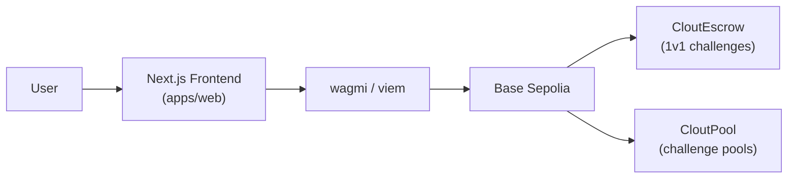

# Clout

Clout is a stake-backed conviction market on Base Sepolia — make public claims, back them with USDC, and build an on-chain track record.

## Architecture



## Tech Stack

| Layer | Technology |
|---|---|
| Smart contracts | Solidity 0.8.20 + OpenZeppelin (Foundry) |
| Frontend | Next.js 16 / React 19 / Tailwind 4 (TypeScript) |
| Web3 | wagmi v2 + viem + TanStack Query |
| Monorepo | pnpm workspaces + Turborepo |

## Local Development

**Prerequisites**

- Node 20+
- pnpm — `npm i -g pnpm`
- Foundry — `foundryup`

**Clone and install**

```bash
git clone <repo-url> clout
cd clout
pnpm install
```

**Environment**

```bash
cp apps/web/.env.example apps/web/.env.local
```

Fill in the following variables in `apps/web/.env.local`:

```
NEXT_PUBLIC_ESCROW_ADDRESS=
NEXT_PUBLIC_POOL_ADDRESS=
NEXT_PUBLIC_USDC_ADDRESS=
NEXT_PUBLIC_WALLETCONNECT_PROJECT_ID=
```

**Start the dev server**

```bash
pnpm turbo dev
# or
cd apps/web && pnpm dev
```

## Contract Deployment

```bash
cd packages/contracts
forge build
forge test -v
forge script script/Deploy.s.sol --broadcast --rpc-url $BASE_SEPOLIA_RPC_URL --private-key $PRIVATE_KEY
```

After deploying, update `DEPLOYMENTS.md` with the new addresses. Do not commit private keys.

## Project Structure

```
clout/
├── apps/
│   └── web/          # Next.js frontend (@clout/web)
├── packages/
│   ├── contracts/    # Solidity/Foundry (@clout/contracts)
│   └── types/        # Shared TS types (@clout/types)
├── DEPLOYMENTS.md
├── RESEARCH.md
└── turbo.json
```

## Testing

```bash
# Contracts (Foundry)
cd packages/contracts && forge test -v

# TypeScript typecheck (all packages)
pnpm turbo typecheck

# Full build (all packages)
pnpm turbo build
```

## Deployed Addresses

See [DEPLOYMENTS.md](./DEPLOYMENTS.md) for live Base Sepolia contract addresses.
